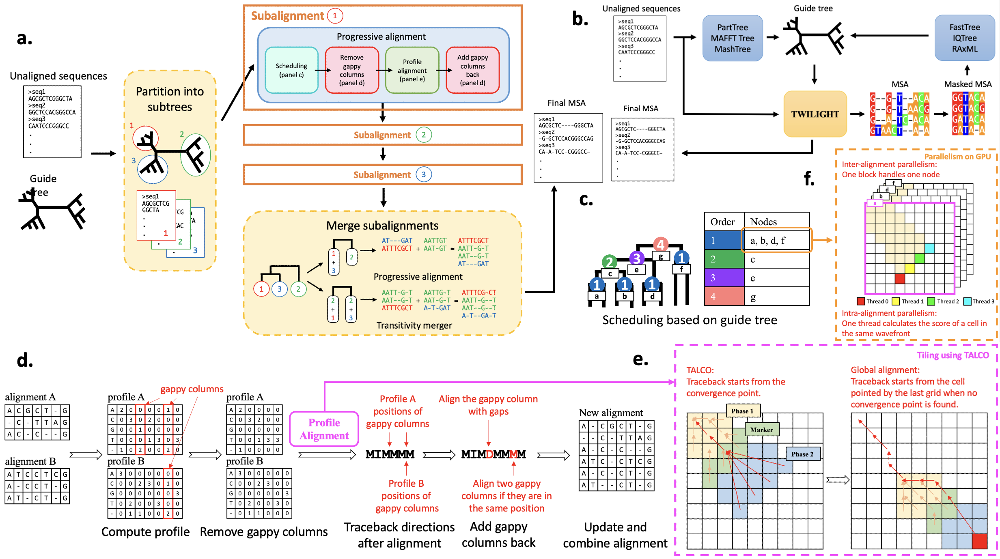

<div align="center">
    
# TWILIGHT: Tall and Wide Alignments at High Throughput

[license-badge]: https://img.shields.io/badge/License-MIT-yellow.svg 
[license-link]: https://github.com/TurakhiaLab/TWILIGHT/blob/main/LICENSE

[![License][license-badge]][license-link]
[](https://cmake.org)
[](https://snakemake.readthedocs.io/en/v7.19.1/index.html)
[](http://bioconda.github.io/recipes/twilight/README.html)
[](https://academic.oup.com/bioinformatics/article/41/Supplement_1/i332/8199405)

<div align="center">
  
</div>

</div>

## What's New

- **TWILIGHT v0.2.0**
  - **Add new sequences:** Support for adding new sequences to an existing alignment.
  - **Protein alignment:** Support for protein alignment, still relatively new and continuously improving.
  - **Iterative mode:** Improved for faster performance.
  - **Flexible tree support:** Allows using a tree that contains more sequences than the actual dataset for alignment.
  - **Bug fixes:** Resolved issues present in TWILIGHT v0.1.4; users are encouraged to update to v0.2.0.

## Table of Contents
- [Introduction](#intro) ([Wiki](https://turakhia.ucsd.edu/TWILIGHT/))
- [Installation](#install)
  - [Summary](#summary) 
  - [Using Conda](#conda)
  - [Using Install Script](#script)
  - [Using Dockerfile](#docker)
- [Run TWILIGHT](#run)
  - [TWILIGHT CLI](#twilight_cli)
    - [Default mode](#default)
    - [Divide-and-Conquer](#dc)
    - [Add new sequences (tree includes placements for new sequences is available)](#add-1)
    - [Merge multiple MSA](#merge-msa)
    - [Flexible tree support](#flex-tree)
  - [Snakemake Workflow](#snakemake)
    - [Iterative mode](#iterative)
    - [Add new sequences (tree unavailable)](#add-2)
- [Contributions](#contribution)
- [Citing TWILIGHT](#cite)

<br>

## <a name="intro"></a> Introduction

TWILIGHT (**T**all and **Wi**de A**lig**nments at **H**igh **T**hroughput) is a tool designed for ultrafast and ultralarge multiple sequence alignment. It is able to scale to millions of long nucleotide sequences (>10000 bases). TWILIGHT can run on CPU-only platforms (Linux/Mac) or take advantage of CUDA-capable GPUs for further acceleration.

By default, TWILIGHT requires an unaligned sequence file in FASTA format and an input guide tree in Newick format to generate the output alignment in FASTA format (Fig. 1a, <a name="default_mode"></a>**default mode**). When a guide tree is unavailable, TWILIGHT provides a Snakemake workflow to estimate guide trees using external tools (Fig 1b, <a name="iter"></a>**iterative mode**).

TWILIGHT adopts the progressive alignment algorithm (Fig. 1c) and employs tiling strategies to band alignments (Fig. 1e). Combined with a divide-and-conquer technique (Fig. 1a), a novel heuristic dealing with gappy columns (Fig. 1d) and support for GPU acceleration (Fig. 1f), TWILIGHT demonstrates exceptional speed and memory efficiency.

<div align="center">
    <div><b>Figure 1: Overview of TWILIGHT alogorithm</b></div>
    
</div>

## <a name="install"></a> Installation
### <a name="summary"></a> Installation summary (choose your installation method)

TWILIGHT offers multiple installation methods for different platforms and hardware setups:
- Conda is recommended for most users needing the [default mode](#default_mode) and *partial* [iterative mode](#iter) support, as some tree tools may be unavailable on certain platforms.
- Install script is required for AMD GPU support.
- Docker (built from the provided Dockerfile) is recommended for full support for [iterative mode](#iter).

| Platform / Setup       | [Conda](#conda) | [Script](#script) | [Docker](#docker) |
|------------------------|-----------------|-------------------|-------------------|
| Linux (x86_64)         | ✅               | ✅                | ✅                |
| Linux (aarch64)        | ✅               | ✅                | 🟡                |
| macOS (Intel Chip)     | ✅               | ✅                | ✅                |
| macOS (Apple Silicon)  | ✅               | ✅                | 🟡                |
| NVIDIA GPU             | ✅               | ✅                | ✅                |
| AMD GPU                | ❌               | ✅                | ❌                |

🟡 The Docker image is currently built for the `linux/amd64` platform. While it can run on `arm64` systems (e.g., Apple Silicon or Linux aarch64) via emulation, this may lead to reduced performance.

⚠️ To enable **GPU support**, the appropriate GPU drivers must be installed on the host system. This applies to all installation methods (Installation script, Conda, and Docker). The CUDA toolkits and libraries are included in Conda and Docker setups, but must be installed manually when using the installation script.  

### <a name="conda"></a> Using Conda
TWILIGHT is available on multiple platforms via Conda. See [TWILIGHT Bioconda Page](https://anaconda.org/bioconda/twilight) for details.  

**Step 1:** Create and activate a Conda environment (ensure Conda is installed first)
```bash
conda create -n twilight python=3.11 -y
conda activate twilight
# Set up channels
conda config --add channels defaults
conda config --add channels bioconda
conda config --add channels conda-forge
conda config --set channel_priority strict
# Install TWILIGHT
conda install bioconda::twilight
```
**Step 2 (optional):** Install TWILIGHT iterative mode
```bash
git clone https://github.com/TurakhiaLab/TWILIGHT.git
cd TWILIGHT
bash ./install/installIterative.sh
```

### <a name="script"></a> Using installation script (requires sudo access if certain common libraries are not already installed)  

Users without sudo access are advised to install TWILIGHT via [Conda](#conda) or [Docker](#docker).

**Step 1:** Clone the repository
```bash
git clone https://github.com/TurakhiaLab/TWILIGHT.git
cd TWILIGHT
```
**Step 2:** Install dependencies (requires sudo access)

TWILIGHT depends on the following common system libraries, which are typically pre-installed on most development environments:
```bash
- wget
- build-essential 
- cmake 
- libboost-all-dev 
```
It also requires `libtbb-dev`, which is not always pre-installed on all systems. For users who do not have sudo access and are missing **only** `libtbb-dev`, our script builds and installs TBB from source in the local user environment, with **no sudo access required**.

For Ubuntu users with sudo access, if any of the required libraries are missing, you can install them with:
```bash
sudo apt install -y wget build-essential libboost-all-dev cmake libtbb-dev
```
For Mac users, install dependencies using **Homebrew**:
```bash
xcode-select --install # if not already installed
brew install wget boost cmake tbb
```

**Step 3:** Build TWILIGHT

Our build script automatically detects the best available compute backend **(CPU, NVIDIA GPU, or AMD GPU)** and builds TWILIGHT accordingly. Alternatively, users can manually specify the desired target platform.

Automatic build:
```bash
bash ./install/buildTWILIGHT.sh
```
Build for a specific platform:
```bash
bash ./install/buildTWILIGHT.sh cuda # For NVIDIA GPUs
bash ./install/buildTWILIGHT.sh hip  # For AMD GPUs
```
**Step 4:** The TWILIGHT executable is located in the `bin` directory and can be run as follows:
```bash
cd bin
./twilight --help
```
**Step 5 (optional)**<a name="install_iter"></a> Install TWILIGHT iterative mode (ensure Conda is installed first)
```bash
# Create and activate a Conda environment 
conda create -n twilight python=3.11 -y
conda activate twilight
# Install Snakemake and tree inference tools
bash ./install/installIterative.sh
```

### <a name="docker"></a> Using Dockerfile
The Dockerfile installed all the dependencies and tools for TWILIGHT default/iterative mode. 

**Step 1:** Clone the repository
```bash
git clone https://github.com/TurakhiaLab/TWILIGHT.git
cd TWILIGHT
```
**Step 2:** Build a docker image (ensure Docker is installed first)

CPU version
```bash
cd docker/cpu
docker build -t twilight .
```
GPU version (using nvidia/cuda as base image)
```bash
cd docker/gpu
docker build -t twilight .
```
**Step 3:** Start and run docker container

CPU version
```bash
docker run --platform=linux/amd64 -it twilight
```
GPU version  
```bash
docker run --platform=linux/amd64 --gpus all -it twilight
```
**Step 4:** Run TWILIGHT
```bash
cd bin
./twilight -h
```


## <a name="run"></a> Run TWILIGHT
### <a name="twilight_cli"></a> TWILIGHT CLI
For more information about TWILIGHT's options and instructions, see [wiki](https://turakhia.ucsd.edu/TWILIGHT/) or *Help* for more details. 
```bash
cd bin
./twilight -h
```
#### <a name="default"></a> Default Mode
Performs a standard progressive alignment using default configurations.

Usage syntax
```bash
./twilight -t <tree file> -i <sequence file> -o <output file>
```
Example
```bash
./twilight -t ../dataset/RNASim.nwk -i ../dataset/RNASim.fa -o RNASim.aln
```
#### <a name="dc"></a> Divide-and-Conquer Method
To reduce the CPU’s main memory usage, TWILIGHT divides tree into subtrees with at most *m* leaves, and align subtrees sequentially. The parameter *m* is user-defined.

Usage syntax
```bash
./twilight -t <tree file> -i <sequence file> -o <output file> -m <maximum subtree size>
```
Example
```bash
./twilight -t ../dataset/RNASim.nwk -i ../dataset/RNASim.fa -o RNASim.aln -m 200
```
#### <a name="add-1"></a> Add New Sequences to an Existing Alignment
For better accuracy, it is recommended to use a tree that includes placements for the new sequences. If no tree is provided, TWILIGHT aligns new sequences to the profile of the entire backbone alignment, which may reduce accuracy. In this case, using the provided [Snakemake workflow](#add-2) is advised.
```bash
./twilight -a <backbone alignment file> -i <new sequence file> -t <tree with placement of new sequences> -o <path to output file>
```
Example
```bash
./twilight -a ../dataset/RNASim_backbone.aln -i ../dataset/RNASim_sub.fa -t ../dataset/RNASim.nwk -o RNASim.aln
```
#### <a name="merge-msa"></a> Merge Multiple MSA Files
To merge multiple MSAs, place all MSA files into a single folder.

Usage syntax
```bash
./twilight -f <path to the folder> -o <output file>
```
Example
```bash
./twilight -f ../dataset/RNASim_subalignments/ -o RNASim.aln
```
#### <a name="flex-tree"></a> Flexible Tree Support
Prunes tips that are not present in the raw sequence file. This is useful when working with a large tree but only aligning a subset of sequences, without needing to re-estimate the guide tree. Outputting the pruned tree is also supported.

Usage syntax
```bash
./twilight -t <large tree file> -i <subset of raw sequences> -o <output file> --prune [--write-prune]
```
Example
```bash
./twilight -t ../dataset/RNASim.nwk -i ../dataset/RNASim_sub.fa -o RNASim_sub.aln --prune --write-prune
```
### <a name="snakemake"></a> Snakemake Workflow
For more information about TWILIGHT's options and instructions, see [wiki](https://turakhia.ucsd.edu/TWILIGHT/) or *Help* for more details. To set up the environment and install external tools, see [here](#install-iter).

#### Setup 
 - For users who install TWILIGHT via Conda, please replace the executable path `"../bin/twilight"` with `"twilight"` in `config.yaml`. Feel free to switch to a more powerful tree tool if available, such as replacing `"raxmlHPC"` with `"raxmlHPC-PTHREADS-AVX2"` for better performance.   
 - Note that since some tree-building tools can’t automatically detect the sequence type, specifying datatype is required in TWILIGHT iterative mode: use `TYPE=n` for nucleotide sequences or `TYPE=p` for protein sequences.   

Enter `workflow` directory and type `snakemake` to view the help messages.

```bash
cd workflow
snakemake
# or, for Snakemake versions that require specifying total number of cores:
snakemake --cores 1
```
#### <a name="iterative"></a> Iterative Mode
TWILIGHT iterative mode estimate guide trees using external tools. 

Supported tree inference tools:
- Initial guide tree: `parttree`, `maffttree`, `mashtree`
- Intermediate iterations (optimized for speed): `rapidnj`, `fasttree`
- Final tree (optimized for quality): `fasttree`, `raxml`, `iqtree`

Usage syntax
```bash
snakemake [--cores <num threads>] --config TYPE=VALUE SEQ=VALUE OUT=VALUE [OPTION=VALUE ...]
```
Example  
- Using default configurations
```bash
snakemake --cores 8 --config TYPE=n SEQ=../dataset/RNASim.fa OUT=RNASim.aln
```
- Generates the final tree based on the completed MSA.
```bash
snakemake --cores 8 --config TYPE=n SEQ=../dataset/RNASim.fa OUT=RNASim.aln FINALTREE=fasttree
```
#### <a name="add-2"></a> Add New Sequences to an Existing Alignment
TWILIGHT aligns new sequences to the profile of the backbone alignment, infers their placement with external tools, and then refines the alignment using the inferred tree.

Usage syntax
```bash
snakemake [--cores <num threads>] --config TYPE=VALUE SEQ=VALUE OUT=VALUE ALN=VALUE [OPTION=VALUE ...]
```
Example  
- The backbone alignment is accompanied by a tree.
```bash
snakemake --cores 8 --config TYPE=n SEQ=../dataset/RNASim_sub.fa OUT=RNASim.aln ALN=../dataset/RNASim_backbone.aln TREE=../dataset/RNASim_backbone.nwk
```
- The backbone tree is unavailable, estimate it using external tools and generate a final tree after alignment.
```bash
snakemake --cores 8 --config TYPE=n SEQ=../dataset/RNASim_sub.fa OUT=RNASim.aln ALN=../dataset/RNASim_backbone.aln FINALTREE=fasttree
```
##  <a name="contribution"></a> Contributions
We welcome contributions from the community to enhance the capabilities of **TWILIGHT**. If you encounter any issues or have suggestions for improvement, please open an issue on [TWILIGHT GitHub page](https://github.com/TurakhiaLab/TWILIGHT). For general inquiries and support, reach out to our team.

##  <a name="cite"></a> Citing TWILIGHT
If you use the <b>TWILIGHT</b> in your research or publications, we kindly request that you cite the following paper:  

Yu-Hsiang Tseng, Sumit Walia, Yatish Turakhia, "<i>Ultrafast and ultralarge multiple sequence alignments using TWILIGHT</i>", Bioinformatics, Volume 41, Issue Supplement_1, July 2025, Pages i332–i341, doi: [10.1093/bioinformatics/btaf212](https://doi.org/10.1093/bioinformatics/btaf212)
